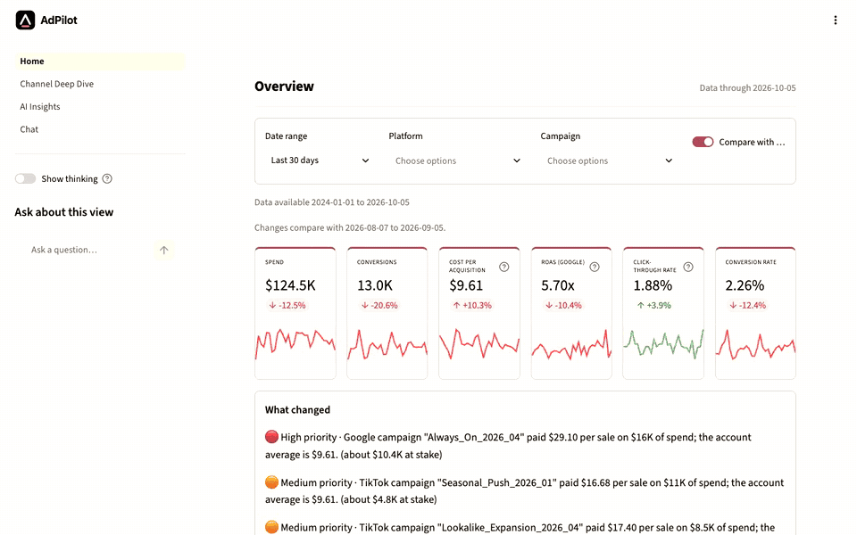
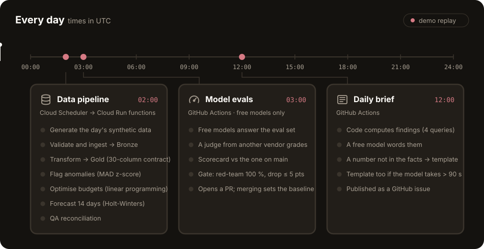

<div align="center">


# AdPilot

**An AI analyst for ad spend.** Ask in plain English and get checked SQL, an answer and a chart.<br>
Every morning, a brief tells you what to fix.

<h3>
<a href="https://adpilot.streamlit.app/">▶ Try the live dashboard</a> ·
<a href="https://codespaces.new/mohiddin7/adpilot">Run it in Codespaces</a> ·
<a href="#-for-developers">Developer guide</a> ·
<a href="docs/">Docs</a>
</h3>

 [](evals/reports/latest.md)   



<p><sub>Recorded on the live dashboard: Overview → AI insights → Chat, with the wait for the answer sped up.</sub></p>
<p><sub>Calibrated synthetic ad data, refreshed nightly. The app sleeps when idle, so a first visit can take about 30 s.</sub></p>

</div>

| 💬 Ask | 📊 See | 📰 Brief | 🛡️ Guarded | 🧪 Measured |
|---|---|---|---|---|
| Plain English in, one read-only SQL query out. A failed query is repaired by the model itself. | A four-page cockpit: KPIs, trends, pacing, and findings ranked by dollars at stake. | A GitHub issue every day with up to three decisions: what happened, why, what to do. | Input guard, SQL guard, row and byte caps, redaction, and an audit row for every call. | A nightly eval of the free models, graded by a judge from another vendor. |

## ⚡ Every request



<details>
<summary>The eight steps of every <code>/ask</code></summary>

1. **Input guard:** regex rules for injection and scope, plus an optional classifier.
2. **Free-model chain:** OpenRouter `:free` models tried in order, `openrouter/free` last ([models](docs/models.md)).
3. **Tools:** `run_sql`, `get_anomalies`, `get_forecast`, `get_budget_plan`, `render_chart`.
4. **SQL guard:** a single read-only SELECT, allow-listed tables, a LIMIT, a bytes-billed cap and a 30 s timeout.
5. **Self-repair:** database errors go back to the model as structured hints (at most 3 queries and 4 model calls).
6. **Output redaction:** secrets and personal data are scrubbed from the answer.
7. **Deadline:** no answer in 100 s → the pack's pre-defined answer, never a stack trace.
8. **Audit:** one row in BigQuery `adpilot_audit` (tokens, latency, model used), plus Logfire/OpenTelemetry spans ([observability](docs/observability.md)).

What each layer can and cannot catch: [docs/security.md](docs/security.md).
</details>

## 🕑 Every day



Latest outputs: [📰 daily briefs](https://github.com/mohiddin7/adpilot/issues?q=is%3Aissue+%22Daily+brief%22+in%3Atitle) · [🧪 eval scorecard](evals/reports/latest.md) · [⚙️ workflow runs](https://github.com/mohiddin7/adpilot/actions)

<details>
<summary>What the daily brief does that a chart doesn't</summary>

- **Explains cost changes.** A platform's cost per sale splits exactly into ad price, clicks per view and sales per click, so the brief names the cause (auction pressure, tired ads, or a landing-page / tracking problem) and the fix that goes with it.
- **Sorts out anomaly noise.** It finds broken tracking (clicks normal, sales down by half or more) and double counting (sales up 3× on normal clicks) even when the detector missed them, and folds small one-day flags into one line.
- **Looks ahead.** Month-end spend against the budgets in `packs/ads/pack.yaml`, and where the 14-day forecast says cost per sale is heading. A big optimizer move becomes a staged test with a stop rule.
- **Follows up.** Every item is stored in `brief_items`, and the next brief reports whether it was resolved, is still open, or expired.

Code computes every number from four fixed read-only queries. One tool-less model call only words the text, and any piece that cites a number not in its facts falls back to a template. Try it locally with `adpilot brief --out brief.md`.
</details>

## 🛠️ For developers

Four levels, each building on the one before. The first two need no cloud account.

### 1️⃣ Ask the agent in 2 minutes (no accounts)

```bash
git clone https://github.com/mohiddin7/adpilot.git && cd adpilot
python3 -m venv .venv && source .venv/bin/activate   # Python 3.11+
pip install -e '.[dev]'
cp .env.example .env
adpilot --connector duckdb chat -q "Which campaign has the worst cost per acquisition?"
```

It runs on DuckDB over the bundled CSVs in `data/raw/`. Without a key it answers from the pack's pre-defined queries and says so. For model answers, put a free [OpenRouter key](https://openrouter.ai/keys) in `.env` as `AGENT_LLM_BEARER_TOKEN`.

```bash
adpilot --connector duckdb chat --session demo   # a REPL that remembers the last 3 turns
adpilot --connector duckdb schema                # what the agent can query
```

### 2️⃣ Run the whole stack locally

The fastest route is **[Open in Codespaces](https://codespaces.new/mohiddin7/adpilot)**: it starts the API on DuckDB and opens the dashboard. Add `AGENT_LLM_BEARER_TOKEN` as a [Codespaces secret](https://github.com/settings/codespaces) for model answers. On your own machine:

```bash
# terminal 1: the API (the dashboard's only backend)
export ADPILOT_API_KEY=$(python -c "import secrets;print(secrets.token_hex(16))")
ADPILOT_CONNECTOR=duckdb ADPILOT_AUDIT=memory uvicorn --factory adpilot.api.app:create_app --workers 1 --port 8080

# terminal 2: the dashboard; give it the same key (or set ADPILOT_API_KEY in .env)
ADPILOT_API_KEY=<same key> streamlit run streamlit_app/Home.py
```

```bash
curl -sX POST localhost:8080/ask -H "X-API-Key: $ADPILOT_API_KEY" -H 'content-type: application/json' \
  -d '{"question":"Which campaign has the worst cost per acquisition?"}'
```

**Use it from Claude.** Claude Desktop and Claude Code get two MCP tools, `ask` and `schema`:

```bash
claude mcp add adpilot -e ADPILOT_AUDIT=memory -- "$(pwd)/.venv/bin/adpilot" --connector duckdb mcp
```

More detail in [api.md](docs/api.md) (auth, `/ask/stream` SSE, the dashboard endpoints) and [mcp.md](docs/mcp.md) (stdio, and the remote `/mcp` on the API).

### 3️⃣ Point it at your own data

Everything domain-specific lives in one folder, a **pack**. Copy `packs/ads/`, edit it, and the same agent, dashboard and evals work on your tables.

| File in `packs/ads/` | What it controls |
|---|---|
| `pack.yaml` | the table allowlist and column descriptions, row/byte caps, query timeout, pre-defined fallback queries, dashboard panels and filters, brief budgets and thresholds |
| `prompts/system.md` | the agent's system prompt |
| `glossary.md` | metric definitions, given to the agent and to the eval judge |
| `duckdb_setup.sql` | how the local CSVs become tables |
| `evals.yaml` | golden questions with reference SQL (`adpilot eval --check-cases` verifies them) |
| `judge_calibration.yaml` | answers with human verdicts; the judge must agree ≥ 80 % to be trusted |
| `eval_fixtures.sql` | eval-only rows for tables DuckDB doesn't have |

### 4️⃣ Replicate the full cloud setup

Everything below fits in free tiers. Each step is a copy-paste runbook in [deploy.md](docs/deploy.md).

| # | What | Runbook |
|---|---|---|
| 1 | A GCP project with BigQuery: datasets for bronze, staging and production, a raw bucket, and the `adpilot_audit` dataset | [Daily data → Prerequisites](docs/deploy.md#prerequisites) · [audit setup](docs/observability.md) |
| 2 | The nightly pipeline: two Cloud Run functions plus a Cloud Scheduler job at 02:00 UTC, running as `adpilot-pipeline` | [Daily data → One-time setup](docs/deploy.md#one-time-setup-owner-run-one-approval-per-step-1) · [Backfill](docs/deploy.md#backfill) |
| 3 | The API on Cloud Run (scale to zero), running as `adpilot-api`, with its key in Secret Manager | [Cloud Run](docs/deploy.md#cloud-run) |
| 4 | The dashboard on Streamlit Community Cloud; its secrets hold only `[api]` URL + key | [Streamlit Cloud](docs/deploy.md#streamlit-cloud-dashboard) |
| 5 | GitHub Actions for the brief and evals. Secrets: `AGENT_LLM_BEARER_TOKEN`, `JUDGE_LLM_BEARER_TOKEN`, `GCP_SERVICE_ACCOUNT_JSON` (the `adpilot-ci` reader), `BQ_PROJECT_ID`, `BQ_STAGING_DATASET`, `BQ_PRODUCTION_DATASET`; optional `JEV_API_KEY`. Variables: `AGENT_LLM_MODELS`, `JUDGE_LLM_MODELS` (optional) | [observability.md](docs/observability.md) · [evals.md](docs/evals.md) |

<details>
<summary>📁 Repo map</summary>

```
adpilot/            the agent: Pydantic AI core, tools, guards, connectors, API, MCP, brief, CLI
packs/ads/          everything domain-specific (see level 3)
pipelines/          00–07 daily steps and the Cloud Run entry point (main.py)
streamlit_app/      the dashboard: an API client with no credentials
evals/              eval harness, scorecard, committed reports
data/raw/           sample CSVs for DuckDB
docs/               api · deploy · evals · mcp · models · observability · security
.github/workflows/  ci · evals-nightly · brief-daily
```
</details>

<details>
<summary>🧪 Tests and evals</summary>

```bash
ruff check . && pytest -q          # deterministic: scripted models (TestModel/FunctionModel) on DuckDB
adpilot eval                       # deterministic eval tier, no key needed
adpilot eval --tier model          # real free models; writes evals/reports/ and the badge
adpilot audit runs                 # recent eval runs from the BigQuery audit trail
```

How scoring works and what the nightly PR means: [evals.md](docs/evals.md).
</details>

<details>
<summary>⚙️ Configuration</summary>

All settings come from `.env` (start from `.env.example`) or, for the deployed API, its Cloud Run environment. Each variable is read under one name only: a legacy spelling is ignored with a warning, never silently aliased.

| Variable | Purpose |
|---|---|
| `AGENT_LLM_BEARER_TOKEN` | OpenRouter key for the agent. Without it, answers come from pre-defined queries. |
| `AGENT_LLM_MODELS` | The agent's model chain, comma-separated and tried in order. Empty → the free defaults in code ([models.md](docs/models.md)). |
| `JUDGE_LLM_BEARER_TOKEN` / `JUDGE_LLM_MODELS` / `JUDGE_LLM_ENDPOINT_URL` | The eval judge's own chain. The eval refuses to start if it shares a model with the agent. |
| `ADPILOT_CONNECTOR` | `duckdb` (bundled CSVs) or `bigquery` |
| `ADPILOT_AUDIT` | `memory` runs unrecorded; otherwise chat and eval need BigQuery credentials |
| `ADPILOT_API_KEY` / `ADPILOT_API_URL` | The API's key (≥ 24 characters) and where the dashboard finds it |
| `ADPILOT_API_RPM` / `ADPILOT_DASHBOARD_RPM` | Rate limits for `/ask` (default 20 / min) and the dashboard endpoints (default 120 / min) |
| `ADPILOT_INPUT_CLASSIFIER` / `JEV_API_KEY` | Optional semantic input classifier (`jev`) |
| `BQ_PROJECT_ID`, `BQ_LOCATION`, `BQ_*_DATASET`, `RAW_BUCKET`, `GCS_BUCKET_NAME` | BigQuery and Cloud Storage, for the `bigquery` connector, the pipelines and the audit trail |
| `GOOGLE_APPLICATION_CREDENTIALS` / `GCP_SERVICE_ACCOUNT_JSON` | BigQuery credentials (a key file path, or the JSON itself) |
| `LOGFIRE_TOKEN` | Optional live OpenTelemetry traces |
</details>

<details>
<summary>🗺️ Roadmap</summary>

| Phase | Deliverable |
|---|---|
| 0 | Repo hygiene, env-driven config, CI ✅ |
| 1 | Data-agnostic agent core (Pydantic AI), typed tools, guardrails, `adpilot chat` CLI ✅ |
| 2 | Eval harness: golden cases, red-team, self-heal rate, LLM judge, scorecard ✅ |
| 3 | Three surfaces over the same agent: FastAPI service ✅ · daily brief ✅ · MCP server ✅ |
| 4 | Pack-driven dashboard ✅ |
| 5 | Production rollout: Docker ✅, tracing ✅, deployed Cloud Run service ✅ |
| 6 | Calibrated synthetic data generator feeding the daily pipeline ✅ |

Started January 2026. The first iteration was lost to a drive failure and rebuilt from June 2026 onward.
</details>

## 📚 Docs

| Doc | What's in it |
|---|---|
| [api.md](docs/api.md) | HTTP endpoints, auth, streaming, rate limits |
| [deploy.md](docs/deploy.md) | Container, Cloud Run, Streamlit Cloud, the daily data pipeline |
| [evals.md](docs/evals.md) | How answers are scored and gated |
| [mcp.md](docs/mcp.md) | Using AdPilot from Claude Desktop / Claude Code |
| [models.md](docs/models.md) | The free-model chains and how to change them |
| [observability.md](docs/observability.md) | Traces and the BigQuery audit tables |
| [security.md](docs/security.md) | Every guardrail layer and its limits |

MIT licensed.
